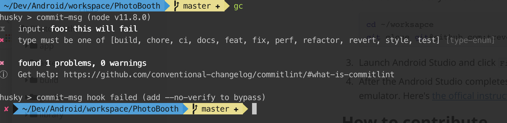
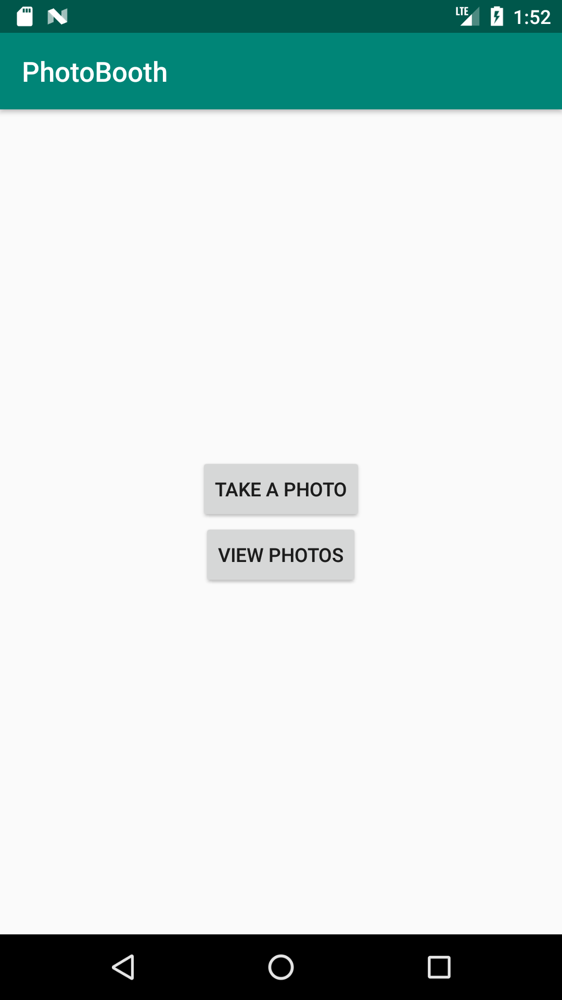
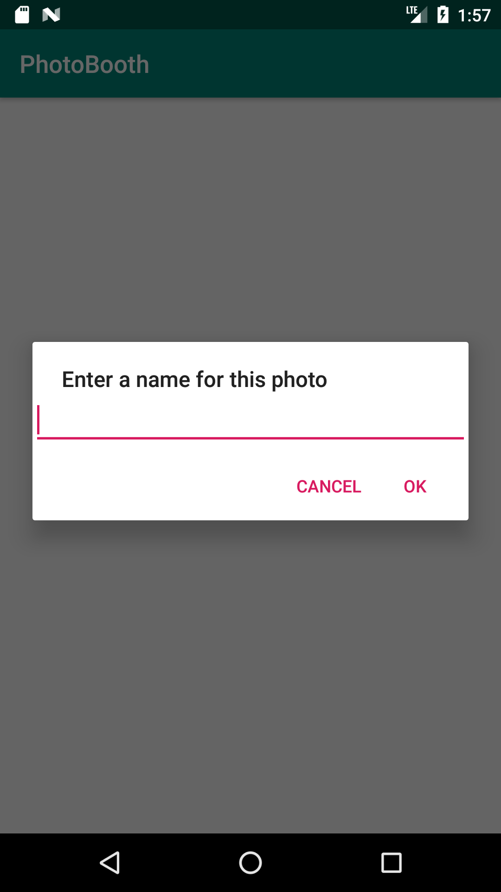
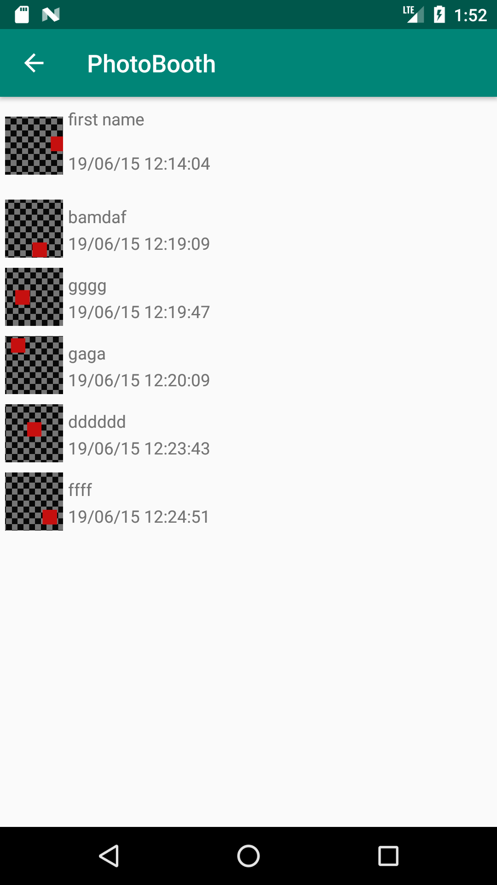
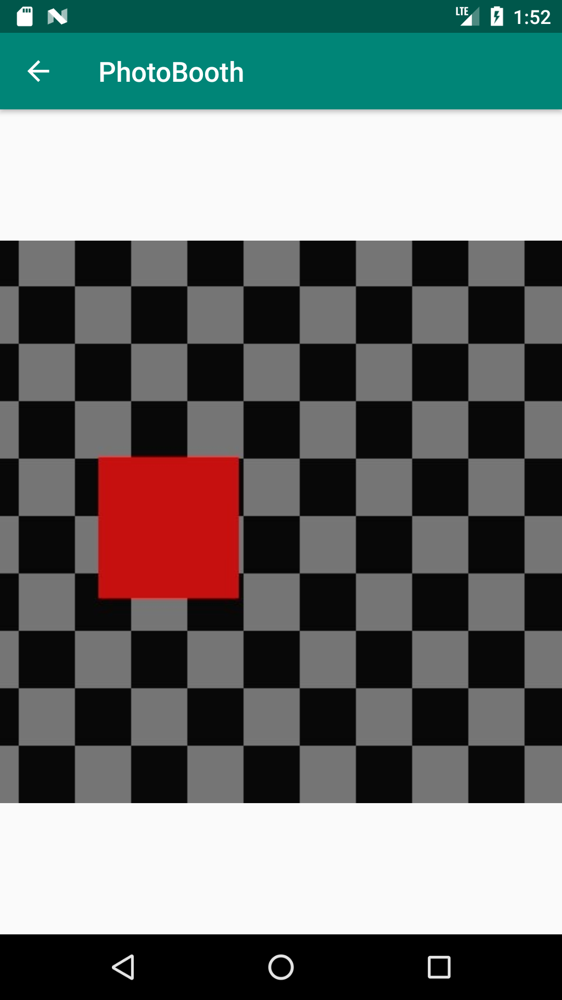

#Photo Booth

## How to setup

1. Follow [the official instruction](https://developer.android.com/studio/install) to install and configure your IDE.

2. Clone this code to your local machine, `~/workspace` for example.

   ```shell
   cd ~/worksapce
   git clone git@github.com:trevorwang/photo-booth.git
   ```

3. Launch Android Studio and click `File > Open`, then select the folder create in preview step 2.

4. After the Android Studio completes the synchronization, click `run` to launch this app to your devcies or emulator. Here's [the offical instruction](https://developer.android.com/studio/run/emulator) if you don't know how to run application.

## Architecture

Basically it follows the classic MVVM architecture.  It uses some Architecture Components like `ViewModel` ,`Room` and other lifecycle-aware classes. Repositry uses RxJava to stream the data changes to View when you register observer for each page.

The project is split to 2 modules, `app` and `library`. All database and file operations are put in `library` module.

## How to contribute

1. Refer to https://commitlint.js.org/#/reference-rules  to get the commit rules.

2. Init the commit lint tool by following the below commands

   ```
   cd ~/workspace/photo-booth
   yarn  # https://yarnpkg.com/lang/en/docs/install
   # or
   npm install  # https://www.npmjs.com/get-npm
   ```

3. `commitlint` will lint your commit message when you commit your code by git command line

   

4. Always create a pull requst to submit your changes.

## What has been approached

1. Main screen to privide "Take a photo" and "View photos" options

   

2. Saving a photo with custom name by using systme camera 

   

3. Photo list page to show all the with the creatation time

   

4. Image preview page to show full size photo

   


## What to be improved

* Remove the captured photo if user click cancel of the dialog
* Provide an empty page for empty and loading states for list page
* Provide loading state for full screen preview page
* Change the page title according to the page content
* Integrate with CI system, like `travis-ci `
* Add more unit tests
* Use databinding library to bind data to view